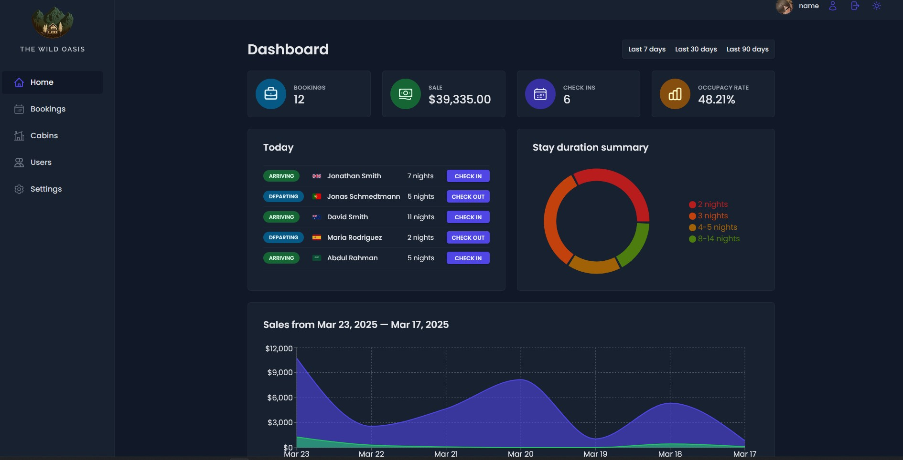
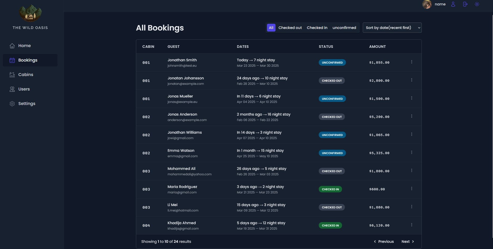
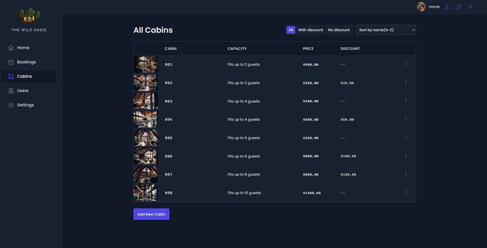
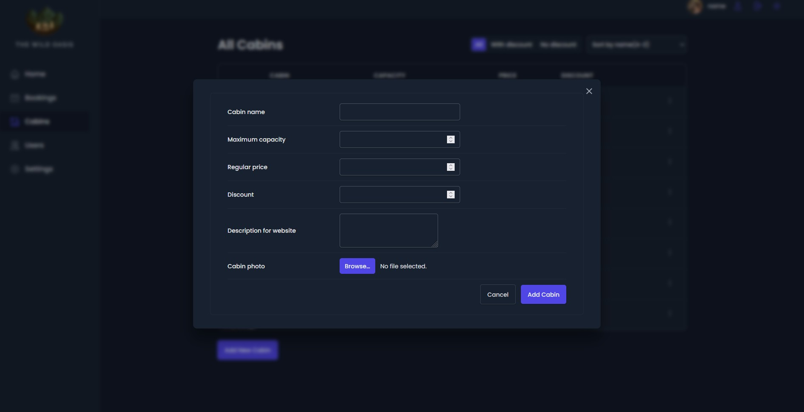

# Wild Oasis - Admin Penal

Welcome to the Wild Oasis - Admin Penal! This is the admin panel of Wild Oasis website, providing clear interface to manage cabins, bookings, and guest information.

This project is a front-stack project built with **React** and styled using **Styled-Component**. It uses **Supabase** not only for database but also data ETL tools, authorization and handling requests(as backend)

The Public Site of this admin penal sharing the same database can be found here:
https://github.com/yiwenwangANU/wild-oasis-website
This project was built following the course on udemy:
https://www.udemy.com/course/the-ultimate-react-course/

## Features ✨

- **Responsive UI:** Developed with React and styled using Styled-Component

- **Data Management:** Integrated Supabase for data fetching and posting.

- **State Management:** Use Redux to manage global state.

## Preview









## Getting Started 🚀

### Installation

Clone the repository and install the dependencies:

```
git clone https://github.com/yiwenwangANU/wild-oasis-v2.git

cd wild-oasis-v2

npm install
```

### Environment Variables

Create .env file in the root dir that contains the following variables

- `VITE_SUPABASE_URL` for supabase access
- `VITE_SUPABASE_KEY` for supabase access
- `VITE_BUCKET_URL` address of supabase bucket

### Running Locally

Start the development server:

```
npm run dev
```

Your app will be available at http://localhost:5173.
